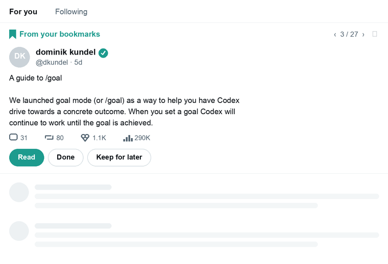
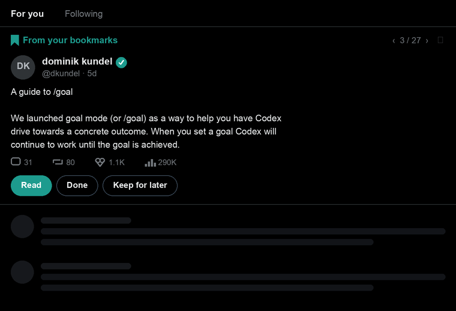
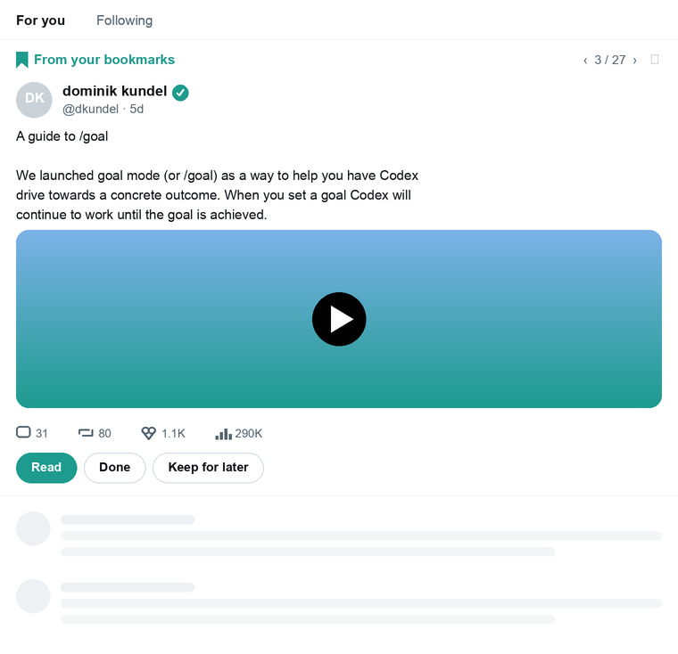

# Bookmark Nudge for X

**语言 / Language:** [中文](#中文) · [English](#english)

<table>
  <tr>
    <td width="50%" align="center"> 浅色 / Light</td>
    <td width="50%" align="center"> 深色 / Dark</td>
  </tr>
  <tr>
    <td colspan="2" align="center"> 含媒体预览与互动数据 / With media preview & engagement stats</td>
  </tr>
</table>

---

## 中文

> 我囤积 X（推特）书签却从不读它们。于是我做了这个扩展：每次打开 X，它都会把一条
> 收藏的帖子注入到主 feed 顶部（几乎就像一条广告）。现在我真的开始读我的书签了。
> --- @zarazhang

**Bookmark Nudge for X** 是一个轻量的 Chrome（Manifest V3）扩展。它把你收藏过的一条
X 帖子，以原生样式的卡片固定在 **For you** 主 feed 的顶部；你可以用「上一条 / 下一条」
翻看，然后选择 **Read（阅读）**、**Done（完成）** 或 **Keep for later（稍后再看）**。

### 主要功能

- **每次打开即推送一条** —— 每次打开 / 刷新 X，主 feed 顶部会出现一张「From your
  bookmarks」卡片（同一次浏览中不会反复打扰）。
- **可翻阅** —— 上一条 / 下一条按钮，配合 `n / N` 位置指示，逐条浏览符合条件的书签。
- **完整内容** —— 显示完整推文正文（含长文 Note）、媒体预览，以及互动数据（回复、转发、
  点赞、浏览量、收藏数），并按 X 的方式格式化为 K / M。
- **三种操作** —— Read 在新标签打开原帖并标记完成（带「撤销」）；Done 直接移出轮换；
  Keep for later 暂存 24 小时。
- **零配置** —— 自动获取你的书签，**无需**手动打开收藏夹页面。
- **自愈能力** —— 自动适配 X 网页端频繁的接口 / DOM 变化。
- **明暗自适应**，并用 Shadow DOM 做样式隔离，绝不与 X 自身样式冲突。

### 安装（加载已解压的扩展）

1. 克隆或下载本仓库。
2. 打开 `chrome://extensions`，开启右上角的 **开发者模式**。
3. 点击 **加载已解压的扩展程序**，选择本文件夹。
4. 在已登录状态下打开 `x.com`，几秒内主 feed 顶部就会出现书签卡片。

无需构建，无需依赖。

### 隐私

这是一个个人工具，通过**你自己**已登录的浏览器会话读取**你自己**的书签，且只在 `x.com`
上运行。它**不会**存储你的 `ct0` 或 `auth_token` Cookie（CSRF token 每次请求实时读取）。
源码里唯一的 token 是 X 网页端公开的 app bearer——一个广为人知的常量，并非机密。书签数据
只保存在你浏览器的本地扩展存储中。

### 已知局限

X 会频繁改动其内部接口与 DOM。本扩展不硬编码这些易变部分（自动重新抓取会轮换的
`queryId` / 功能开关，并使用 `data-testid` / ARIA 选择器），因此在多数版本更新下都能自愈。
若卡片不再出现，重新加载扩展，或打开一次收藏夹页面即可重新初始化。

### 许可证

[MIT](LICENSE)

---

## English

> I hoard X (Twitter) bookmarks and never read them. So I built an extension that,
> every time I open X, injects one of my saved bookmark posts into my Home feed —
> almost like an ad. Now I actually read my bookmarks.

**Bookmark Nudge for X** is a tiny, personal Chrome (Manifest V3) extension that
surfaces one of your saved X bookmarks as a native-looking card pinned to the top of
your **For you** feed. Browse with prev/next, then **Read**, mark **Done**, or
**Keep for later**.

### Features

- **One nudge per open** — a "From your bookmarks" card appears at the top of Home
  each time you open/reload X (it won't nag within the same view).
- **Browsable** — prev/next (上一条 / 下一条) with an `n / N` position indicator to
  page through eligible bookmarks.
- **Full content** — the complete tweet text (incl. long-form notes), a media
  preview, and engagement stats (replies, reposts, likes, views, bookmarks) with K/M
  formatting.
- **Read / Done / Keep for later** — Read opens the tweet and marks it done (with
  Undo); Done removes it from rotation; Keep snoozes it 24h.
- **Zero setup** — seeds your bookmarks automatically; you never open the bookmarks
  page.
- **Self-healing** — adapts to X's frequent web-app changes on its own.
- **Light/dark aware**, isolated via Shadow DOM so X's styles never clash.

### Install (load unpacked)

1. Clone or download this repo.
2. Open `chrome://extensions`, enable **Developer mode** (top right).
3. Click **Load unpacked** and select this folder.
4. Open `x.com` while logged in. Within a few seconds a bookmark card appears at the
   top of your Home feed.

No build step. No dependencies.

### Privacy

This is a personal tool that reads **your own** bookmarks via **your own** logged-in
browser session. It runs only on `x.com`. It never stores your `ct0` or `auth_token`
cookies (the CSRF token is read fresh per request). The only token in the source is
X's public web-client app bearer — a well-known constant, not a secret. Bookmark data
lives only in your browser's local extension storage.

### Known fragilities

X changes its internal API and DOM frequently. This extension avoids hardcoding the
volatile bits (it re-scrapes the rotating `queryId`/feature flags and uses
`data-testid`/ARIA selectors), so it self-heals across most deploys. If a card ever
stops appearing, reload the extension or open your bookmarks page once to re-seed.

### License

[MIT](LICENSE)
